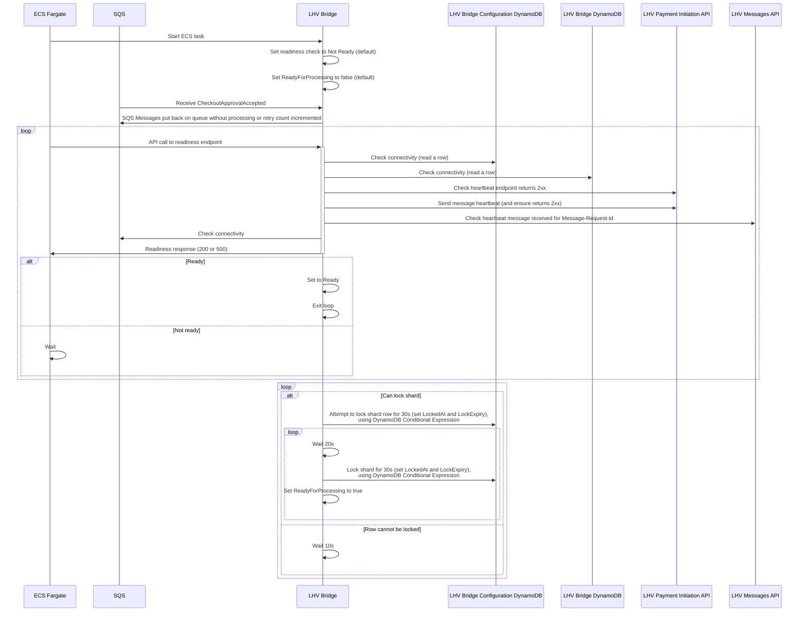
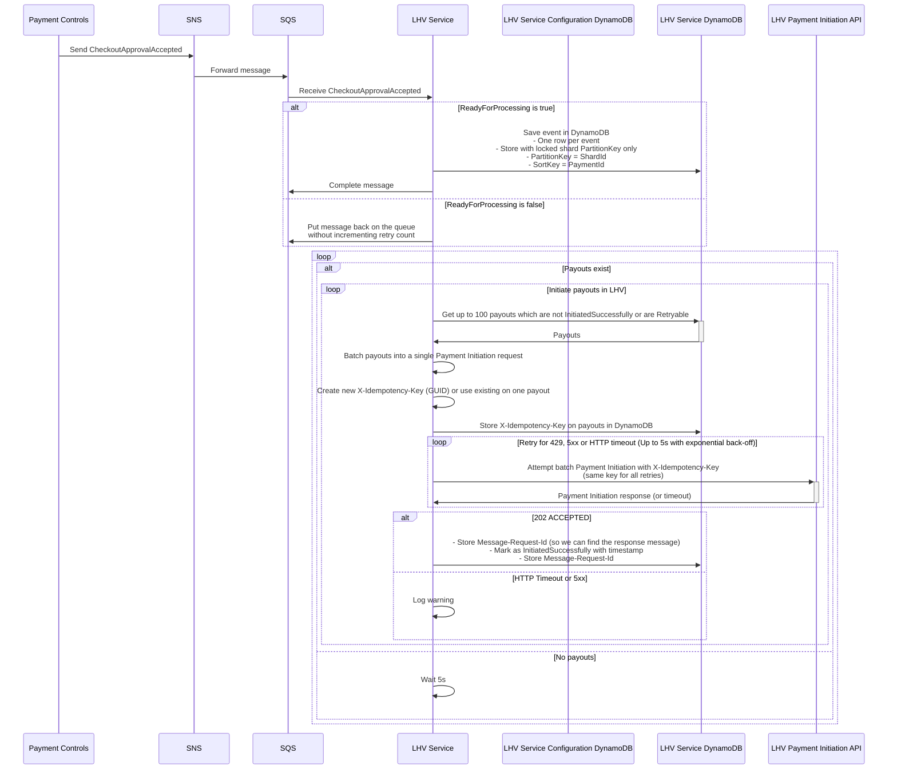

# LHV Integration

## LHV service startup

* LHV Service is the Bank Payouts service that connects to LHV

 
 
 
 
 
 
 
 

## Payment Initiation

* `CheckoutApprovalAccepted` events written to DynamoDB
* Background process batches these and sends to LHV

 
 
 
 
 
 
 
 

## Handling responses

## Graceful shutdown

## Ungraceful shutdown
