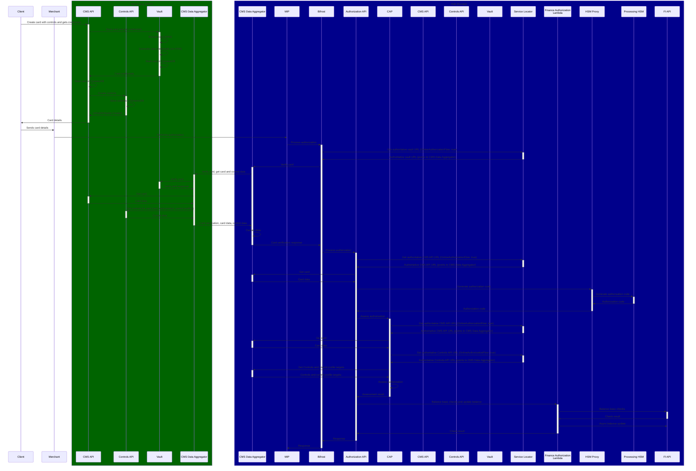

# Card and control reads and writes in the spoke

Spoke (e.g. APAC):
* CMS API
* Controls API
* Vault

Hub (Europe): All other services

Only normal operation shown (with CMS services in the spoke region, i.e. not a failover scenario)

