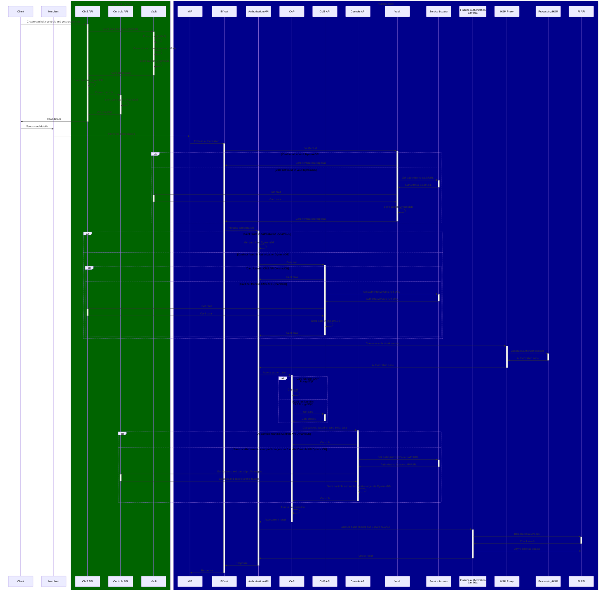

# Virtual card creation in spoke

Spoke (e.g. APAC):
* CMS API
* Controls API
* Vault

Hub (Europe): All other services

```mermaid
sequenceDiagram

participant Client
participant Merchant

box darkgreen Spoke (e.g. APAC)
    participant CMSAPI1 as CMS API
    participant ControlsAPI1 as Controls API
    participant Vault1 as Vault
end

box darkblue Hub (Europe)
    participant MIP
    participant Bifrost
    participant AuthAPI as Authorization API
    participant CAP
    participant CMSAPI2 as CMS API
    participant ControlsAPI2 as Controls API
    participant Vault2 as Vault
    participant ServiceLocator as Service Locator
    participant Finance as Finance Authorization <br>Lambda
    participant HSMProxy as HSM Proxy
    participant ProcessingHSM as Processing HSM
    participant FIAPI as FI API
end

Client->>+CMSAPI1: Create card with controls and gets credentials
CMSAPI1->>+Vault1: Store card and get credentials
Vault1->>Vault1: Encrypt card (KMS)
Vault1->>Vault1: Generate card credentials (no HSM)
Vault1->>Vault1: Store card in DynamoDB
Vault1->>-CMSAPI1: Card credentials
CMSAPI1->>CMSAPI1: Store card in DynamoDB
CMSAPI1->>+ControlsAPI1: Create controls
ControlsAPI1->>ControlsAPI1: Store controls in DynamoDB
ControlsAPI1->>-CMSAPI1: 201 Created
CMSAPI1->>-Client: Card details

Client->>Merchant: Sends card details
Merchant->>MIP: Performs authorization
MIP->>+Bifrost: Process authorization
Bifrost->>+Vault2: Verify card

alt Card found in Vault DynamoDB
    Vault2->>Bifrost: Card verification response
else Card not found in Vault DynamoDB
    Vault2->>+ServiceLocator: Get authoritative vault URL
    ServiceLocator->>-Vault2: Authoritative vault URL
    Vault2->>+Vault1: Get card
    Vault1->>-Vault2: Card data
        Vault2->>Vault2: Store card in DynamoDB
    Vault2->>-Bifrost: Card verification response
end

Bifrost->>+AuthAPI: Process authorization

alt Card found in Authorization DynamoDB
    AuthAPI->>AuthAPI: Get card from DynamoDB
else Card not found in Authorization DynamoDB
    AuthAPI->>+CMSAPI2: Get card
    alt Card found in CMS API DynamoDB
        CMSAPI2->>AuthAPI: Card data
    else Card not found in CMS API DynamoDB
        CMSAPI2->>+ServiceLocator: Get authoritative CMS API URL
        ServiceLocator->>-CMSAPI2: Authoritative CMS API URL
        CMSAPI2->>+CMSAPI1: Get card
        CMSAPI1->>-CMSAPI2: Card data
        CMSAPI2->>CMSAPI2: Store card in DynamoDB
        CMSAPI2->>-AuthAPI: Card data
    end
end

AuthAPI->>+HSMProxy: Generate authorization code
HSMProxy->>+ProcessingHSM: Generate authorization code
ProcessingHSM->>-HSMProxy: Authorization code
HSMProxy->>-AuthAPI: Authorization code
AuthAPI->>+CAP: Assess authorization

alt Card found in CAP PostgeSQL
    CAP->>CAP: Get card
else Card not found in CAP PostgeSQL
    CAP->>+CMSAPI2: Get card
    CMSAPI2->>-CAP: Card details
end

CAP->>+ControlsAPI2: Get controls based on card initial data
alt All controls found in Controls API DynamoDB
    ControlsAPI2->>CAP: Controls
else Some or all controls/control profile targets not found in Controls API DynamoDB
    ControlsAPI2->>+ServiceLocator: Get authoritative Controls API URL
    ServiceLocator->>-ControlsAPI2: Authoritative Controls API URL
    ControlsAPI2->>+ControlsAPI1: Get Controls and control profile targets
    ControlsAPI1->>-ControlsAPI2: Controls and control profile targets
    ControlsAPI2->>ControlsAPI2: Store controls and control profile targets in DynamoDB
    ControlsAPI2->>-CAP: Controls
end

CAP->>CAP: Assess authorization
CAP->>-AuthAPI: Assessment result
AuthAPI->>+Finance: Balance basic checks and update balance
Finance->>+FIAPI: Balance basic checks
FIAPI->>-Finance: Check result
Finance->>FIAPI: Async balance update
Finance->>-AuthAPI: Check result
AuthAPI->>-Bifrost: Response
Bifrost->>-MIP: Response
```