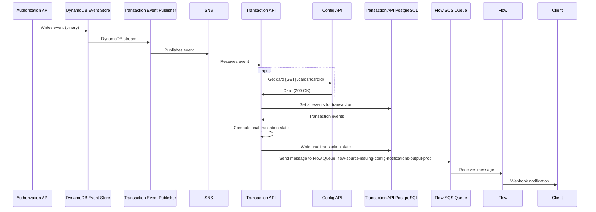

# Payments webhooks

```mermaid
sequenceDiagram

Authorization API->>DynamoDB Event Store: Writes event (binary)
DynamoDB Event Store->>Transaction Event Publisher: DynamoDB stream
Transaction Event Publisher->>SNS: Publishes event
SNS->>Transaction API: Receives event

opt 
Transaction API->>Config API: Get card [GET] /cards/{cardId}
Config API->>Transaction API: Card (200 OK)
end


Transaction API->>Transaction API PostgreSQL: Get all events for transaction
Transaction API PostgreSQL->>Transaction API: Transaction events
Transaction API->>Transaction API: Compute final transation state
Transaction API->>Transaction API PostgreSQL: Write final transaction state
Transaction API->>Flow SQS Queue: Send message to Flow Queue: flow-source-issuing-config-notifications-output-prod

Flow SQS Queue->>Flow: Receives message
Flow->>Client: Webhook notification
```